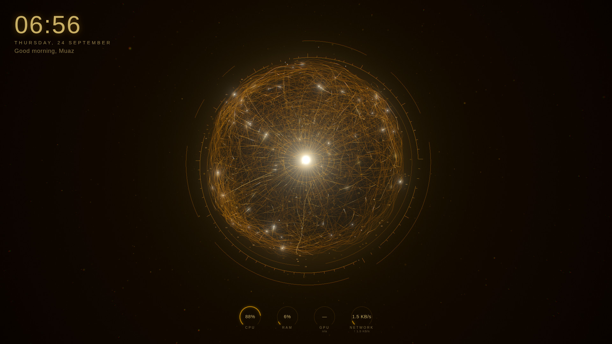
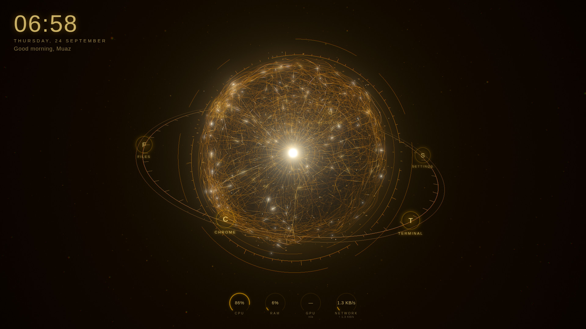
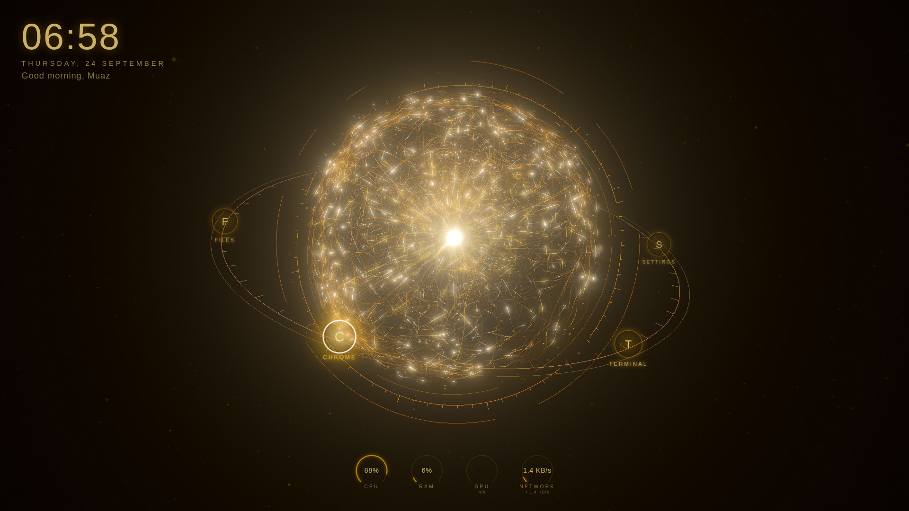
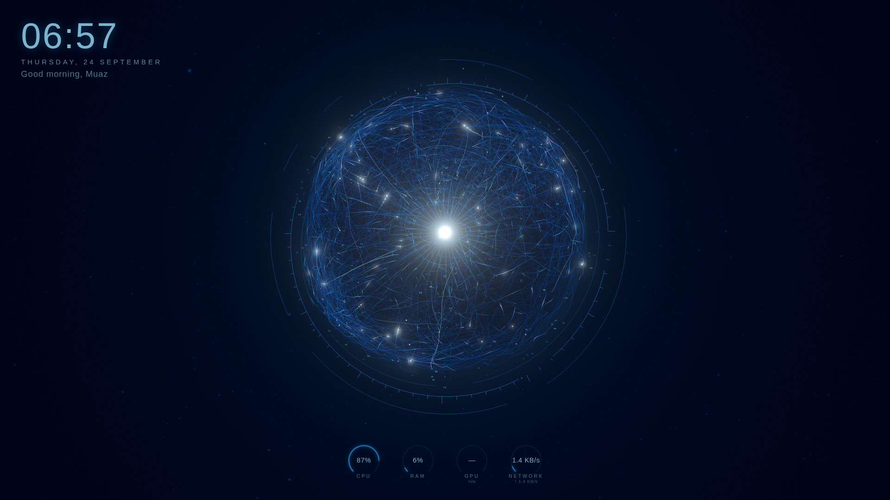
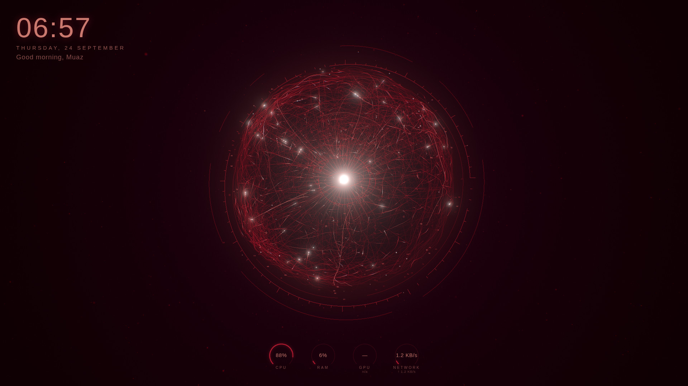
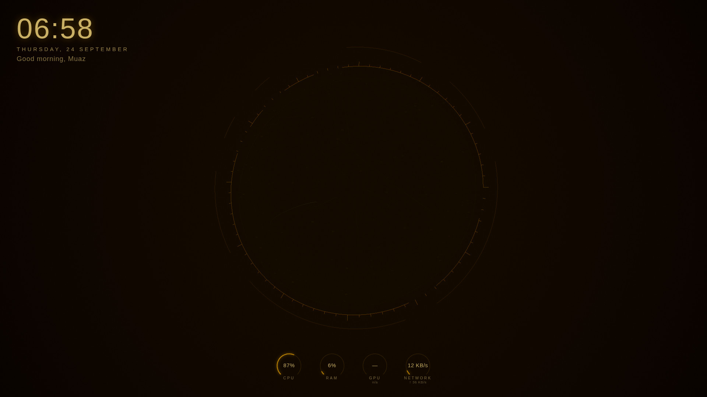
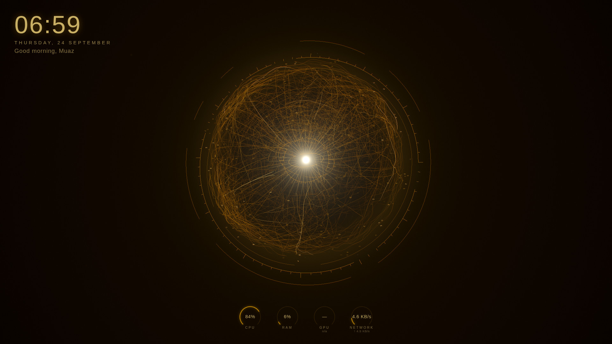
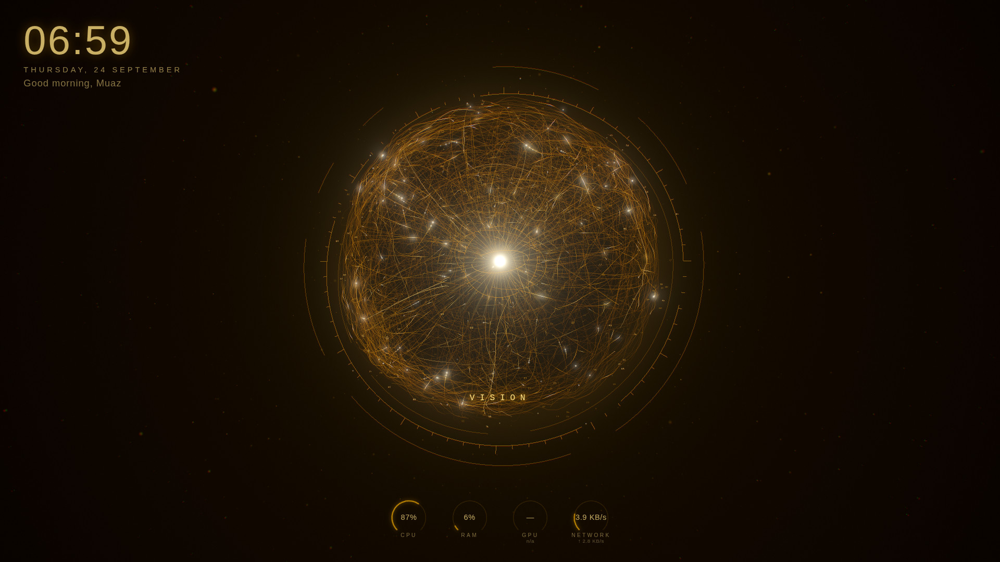
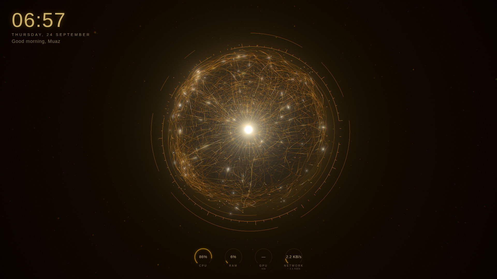
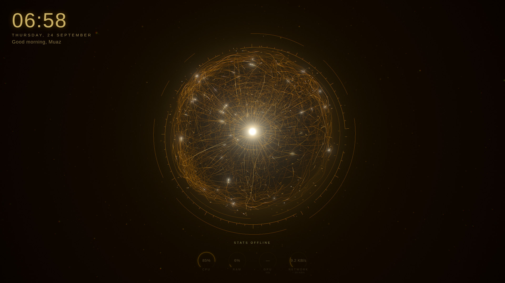

# VISION Orb

**A living neural-energy orb for your Windows desktop.** Thousands of golden filaments
wrap a white-hot core. Signals travel along them, the network breathes and slowly
rewires, and a quiet HUD shows time, system load and an app launcher that springs out of
the orb.

It runs as a [Lively Wallpaper](https://www.rocksdanister.com/lively/) web wallpaper
(WebView2 + WebGL2), with an optional tiny local helper for system stats and app
launching.



| App ring | Launch pulse | Arc Blue | Crimson |
|---|---|---|---|
|  |  |  |  |

| Boot 0.35 s | Boot 1.0 s | Boot 1.6 s | Hover | Stats offline |
|---|---|---|---|---|
|  |  |  |  |  |

The screen recording is at [`docs/media/vision-orb.webm`](docs/media/vision-orb.webm)
(30 fps, deterministic capture). All screenshots are in [`docs/screenshots/`](docs/screenshots/).

> The reference renders were made headlessly with Chromium's SwiftShader (CPU)
> renderer, which produces the same image as a GPU. The clock in them shows the capture
> time.

This is an original design. It does not use any film assets, names, logos, sounds or UI
layouts.

---

## Install

For non-developers, see **[SETUP.md](SETUP.md)**. Short version:

1. Install Lively Wallpaper.
2. Add `wallpaper\index.html` to Lively.
3. Lively → Settings → Wallpaper → Wallpaper Input → **Mouse**.
4. Run `helper\install-helper.ps1` (no admin needed), then reload the wallpaper.
5. Edit `helper\apps.json` to pick the apps in the ring.

The `wallpaper/` folder is the built, ready-to-use wallpaper. It is fully offline: one
local script, no CDN, and no network access other than `127.0.0.1`.

## Architecture

```
Windows
 ├── Lively Wallpaper
 │     └── WebView2 ── wallpaper/index.html  (classic script, file://)
 │           ├── OrbSystem      10 draw calls, all animation on the GPU
 │           ├── RenderCore     WebGL2 · half-res bloom · final grade pass · DPR ≤ 1.5
 │           ├── Scheduler      60 fps interacting · 30 fps idle · 0 fps paused/hidden
 │           ├── StateMachine   IDLE HOVER DRAG APP_RING LAUNCHING RESET PAUSED
 │           ├── Input          OrbitControls (damped) · hover · click/dblclick · idle return
 │           ├── HUD            clock · greeting · arc gauges · boot · link status
 │           ├── AppRing        3D-orbiting DOM nodes · energy beam · launch pulse
 │           └── HelperClient   polls /stats, backs off, never blocks rendering
 │                  │  HTTP, X-Vision-Token, 127.0.0.1 only
 └── VISION Helper  helper/bin/vision-helper.exe (Go, single exe)
        ├── GET  /stats         PDH counters, collected ≤ 1×/s, cached, idle-suspending
        ├── GET  /apps          id · label · icon (never paths)
        ├── POST /launch/{id}   whitelist → CreateProcess (no shell)
        └── Task Scheduler      logon start · restart on failure · 5-min watchdog
```

The wallpaper works with the helper missing: the orb never waits on it. The HUD shows
**STATS OFFLINE** and reconnects automatically. This is tested end to end.

### The orb

| Layer | Technique |
|---|---|
| Outer filament shell (1,500–4,000 strands) | One merged indexed `LineSegments`, generated once. It mixes four strand families: arcs, swirl-steered walks, tangles and dendrites. They follow a density field calibrated to 15% dense / 55% medium / 20% sparse / 10% empty. |
| Living motion | 4D simplex noise (xyz + time), domain-warped in the vertex shader. It adds breathing, shimmer, and strands that slowly fade out and back in, so the network appears to rewire. |
| Inner filament volume (500–1,400 strands) | Same generator at 0.28–0.74 R, dimmer, counter-rotating for parallax |
| Signal pulses | A closed-form function of (strand seed, clock), shared by the line shader (comet tail) and a sprite shader (bright head read from a position texture), so heads ride exactly on their tails |
| Core | Billboard shader: hot-white centre, radial spokes, 3.2 s breathing, rotating core rings |
| Sparks | Stateless GPU particles: escape, decelerate, fade |
| Dust, data glyphs, halo, orbit rings | One draw each |
| Post | Half-res UnrealBloom, then one pass for hue-preserving tone map, subtle chromatic aberration, vignette and black point |

About 62k line segments and 3.7k points on Medium, in **10 draw calls** for the orb
(24 including post). There is no per-strand JavaScript and no per-frame allocation. Theme
and quality changes are uniform writes and draw-range changes only.

## Performance summary

See **[PERF_REPORT.md](PERF_REPORT.md)** for all numbers and how each was measured.

| Metric | Result | Measured where |
|---|---|---|
| Frame pacing idle / interaction / paused | **30.0 / 60.0 / 0 fps** | Chromium, scheduler measured |
| Orb draw calls | **10** (24 incl. post) | Debug overlay |
| Page main-thread CPU per frame | ~1.2–1.5 ms | Chromium (CDP), SwiftShader |
| JS heap | ~3.6 MB, flat over the soak | Chromium (CDP) |
| Helper RAM | **6.5–8.8 MB** (target ≤ 20 MB) | Linux build |
| Helper CPU while polled by the wallpaper | **0.07% of one core** | Linux build |
| Windows CPU/GPU %, game impact, 24 h soak | **Pending, measure on Windows** | `tools/windows/perf-sample.ps1`, `docs/WINDOWS_TEST_PLAN.md` |

## Security model

- **Loopback only.** The helper binds `127.0.0.1` (the address isn't configurable). A
  `Host` header check blocks DNS rebinding, and an `Origin` allow-list admits only the
  wallpaper's `file://` origin (`null`).
- **Per-install secret.** A random 256-bit token is created at install. It's stored in
  `helper/config/config.json`, restricted to your user, and never committed. Every request
  needs `X-Vision-Token`, compared in constant time.
- **The browser sends only app ids.** `POST /launch/{id}` accepts `^[a-z0-9][a-z0-9_-]{0,31}$`
  plus an optional body of exactly `{"app_id": …}`. Paths, commands, arguments and extra
  fields are rejected.
- **Whitelist.** Only apps in `helper/apps.json` can launch. Each must be an absolute,
  local, `.exe` path; UNC, `..`, `.bat`, `.cmd` and `.lnk` are refused. Arguments come
  only from `apps.json`. Processes start through CreateProcess, with no shell.
- **Rate limits** apply in general, on launch, and on failed authentication. Error
  replies carry only a short code, never a path or the token.
- **No camera.** The bundle contains no camera or microphone code. Audio-reactive mode
  uses Lively's system-audio (loopback) feed. It's off by default; enable it once with
  `tools\windows\enable-audio.ps1`.

Results: 20 Go unit tests, 20 black-box tests against the real binary over HTTP, and the
full §53 security matrix. See [docs/TEST_RESULTS.md](docs/TEST_RESULTS.md).

## Configuration

**Lively → Customise:**

- theme (Gold, Arc Blue, Crimson, Custom colour)
- rotation speed, bloom strength and particle density
- quality (Low, Medium, High) and auto-reduce
- audio reactive, HUD stats, greeting name, debug overlay
- helper port and token (advanced)

**Files:**

- `helper/apps.json` — the apps in the ring. It hot-reloads.
- `helper/icons/` — optional app icons.
- `helper/config/config.json` — port and token, created by the installer.

## Troubleshooting

See **[SETUP.md → Troubleshooting](SETUP.md#troubleshooting)**. The common cases:

- **STATS OFFLINE:** the helper isn't running. Task Scheduler restarts it, or re-run the
  installer.
- **SYSTEM LINK UNPAIRED:** re-run the installer after adding the wallpaper to Lively,
  then reload the wallpaper.
- **LAUNCH FAILED · APP_UNAVAILABLE:** a wrong `exe` path. Check with
  `vision-helper.exe --check-apps`.
- **Choppy on a laptop:** use Quality Low and keep auto-reduce on.
- **The Debug overlay** shows fps, GPU ms, draw calls, quality step and helper status.

## Development

```sh
cd web && npm ci
npm run dev             # live-reloading dev server (http://localhost:5173)
npm run build           # → ../wallpaper (wallpaper) and ../tools/phase0 (probe)
cd ../helper && ./build.sh   # → helper/bin/vision-helper.exe (reproducible)
../tests/run-all.sh     # every automated test (Go, Node, headless Chromium)
```

Useful URL parameters when opening `wallpaper/index.html` in a browser:

- `?q=low|medium|high`
- `theme=arc|crimson`
- `debug=1`
- `auto=0`
- `t=<seconds>`, which freezes the animation clock
- `demo=hover|ring|drag`
- `capture=1`, for deterministic stepping

Repository layout:

```
wallpaper/   built Lively wallpaper (index.html, js/vision.js, LivelyInfo.json, LivelyProperties.json,
             token.js, preview.gif, thumbnail.jpg). Shaders and assets are inlined into js/vision.js
             because file:// pages can't fetch separate files (DECISIONS §0).
web/         wallpaper source (Vite + TypeScript + three.js; shaders in src/shaders and src/orb/shaders.ts)
helper/      service/ (Go source) · bin/ · apps.json · icons/ · config/ · install/uninstall scripts
tests/       helper-security/ · launch/ · integration/ · perf/ · run-all.sh
tools/       phase0/ (Lively runtime probe wallpaper) · windows/perf-sample.ps1
docs/        screenshots, media, perf JSON, TEST_RESULTS, WINDOWS_TEST_PLAN
```

## Credits

- **Original orb:** [ultron-by-sagar-builds](https://github.com/SAGAR-TAMANG/ultron-by-sagar-builds)
  by **Sagar Tamang**, MIT License. VISION Orb started as a fork and study of its
  `lib/orbScene.ts`. It carries over the layered-shell idea, drifting code text (now GPU
  "data glyphs"), dust, scan rings (now orbit rings), bloom plus chromatic aberration,
  and damped orbit controls. The rendering was rebuilt around a new neural filament
  system. [DECISIONS.md §15](DECISIONS.md) lists what was kept and what was replaced.
- **4D simplex noise:** [webgl-noise](https://github.com/ashima/webgl-noise) by Ashima
  Arts and Stefan Gustavson, MIT.
- **Libraries:** [three.js](https://threejs.org) (MIT), `golang.org/x/sys` (BSD-3).
- **Host:** [Lively Wallpaper](https://github.com/rocksdanister/lively) by rocksdanister.
  It isn't bundled; you install it separately.

## License

MIT. See [LICENSE](LICENSE), which keeps Sagar Tamang's original copyright notice as
the MIT license requires.
